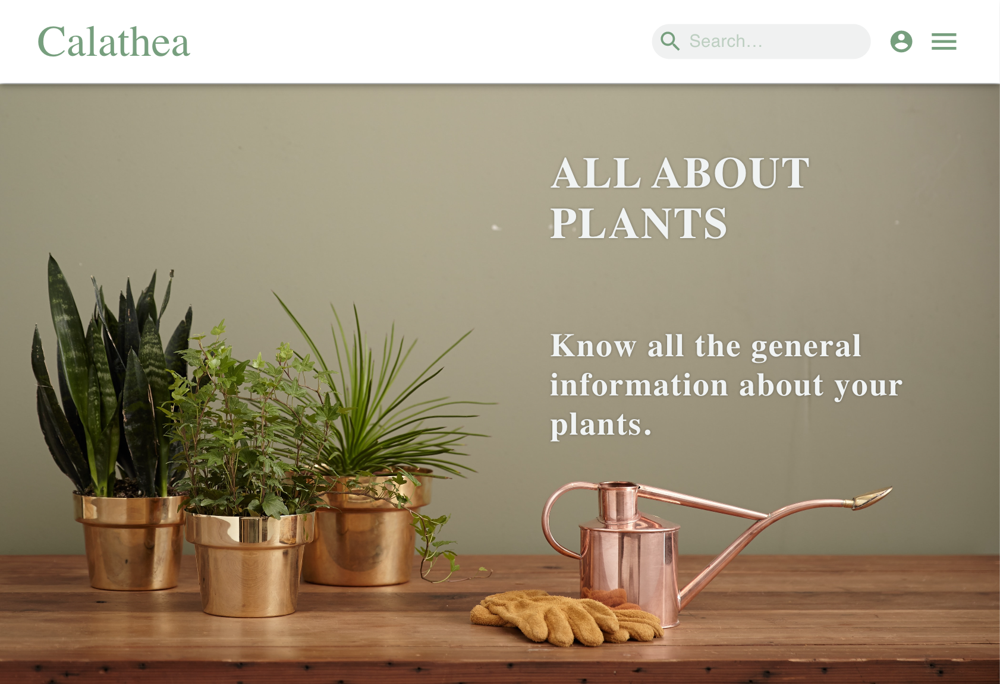

# Calathea
This project is a React App. Please see : https://calathea.netlify.app

## Setup
To install all dependecies run `npm install`.

## Run Locally
To run the project locally run `npm start`.

You can then open the project on http://localhost:3000/ in the browser.
